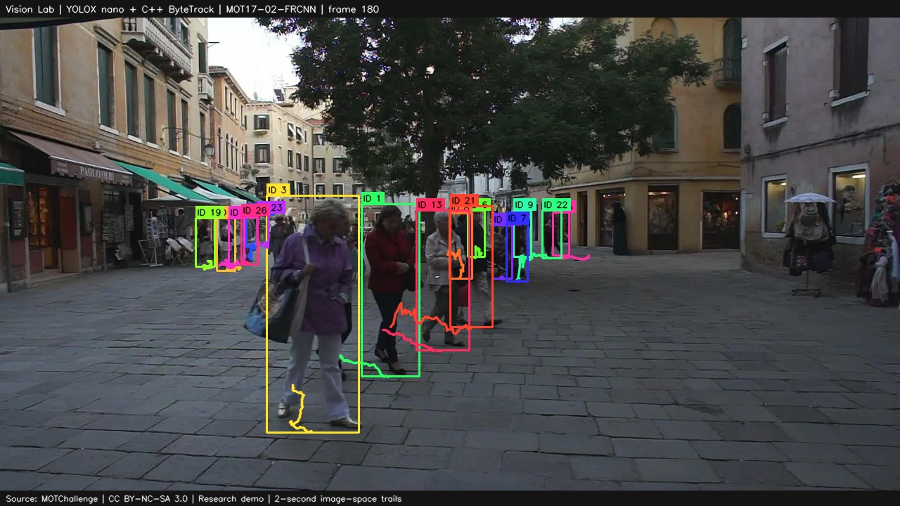

# Vision Lab

Can a small pedestrian detector and tracker run usefully on a local CPU?
This study exports YOLOX nano/tiny to ONNX, reproduces ByteTrack in C++, and
measures accuracy, speed and INT8 quantization. Python provides export,
calibration and evaluation; OpenCV loads images and draws the demonstrations.

## Results

| Measurement | Result |
|---|---|
| C++ reference fidelity | Zero MOTA/IDF1 difference on 14 MOT17 model/sequence pairs; all 22 end-to-end outputs match cached C++ tracking. |
| FP32 speed, 4 threads | **Nano 27.34 FPS**, tiny 9.76 FPS. Nano meets the fixed 25 FPS bar at this budget. |
| MOT20 FP32 quality (motmetrics) | Nano MOTA/IDF1 **56.02/51.37**; tiny **61.08/59.49**. |
| Original INT8 experiment | Nano loses **56.10 MOTA points**. Tiny reaches **18.25 FPS** but loses **1.0635 points**, exceeding the fixed 1.0-point cap. Neither passes. |
| Post-hoc nano control | INT8-stored weights with floating computation restore MOTA to **55.32** (loss **0.705 points**). Speed is **0.97–1.03x** the paired FP32 baseline; acceleration remains unresolved. |
| Clean-clone reproduction | Quality scores and track hashes reproduce **exactly**. Speed medians differ by **−2.73% to +5.76%** across two full reruns. |
| Classical mean-shift bonus (TrackEval) | With annotated first-appearance boxes, MOTA/IDF1 **−252.30/3.11** on all MOT20 frames; nano **62.42/53.31**, tiny **68.05/61.88** under the same evaluator. |

FPS includes JPEG decoding, preprocessing, inference, suppression and tracking
at 608×1088 input, excluding drawing/writing. It was measured in an M2 Max
Docker Linux VM with matched CPU quotas, not on an edge board. MOT17 training
footage measures fidelity; MOT20 supplies held-out measurements. The observed
speed spread is descriptive: the original strict interval failures stay on
record, and [Opus's review](docs/reviews/phase-4-6-opus.md) explains the method's
limitation. Original INT8 failures are preserved; the separate
[post-hoc report](results/phase-4-nano-repair.md) records the diagnosis and failed
acceleration outcome.

MOTA summarizes tracking errors; IDF1 measures identity consistency. Quality
values are percentages; losses are percentage points.
The [mean-shift comparison](results/phase-5-meanshift.md) keeps fixed color
histograms and windows, with no removal after exits. Stale boxes and drift
severely hurt quality. This describes that fixed classical control; its
initial annotations and separate-session timing are explicit limitations.

## Demonstration



MOT17-02, frame 180, nano FP32. Colors follow tracker IDs; occlusion and camera
movement can change an ID. These checkpoints detect **pedestrians only**.
Drawing convincing trails does not establish stable identity or vehicle
tracking. [Measured failure cases](results/phase-5-failures.md) document this.
Frame: MOTChallenge authors, [CC BY-NC-SA 3.0](https://creativecommons.org/licenses/by-nc-sa/3.0/),
non-commercial research; annotation by Vision Lab.

## Reproduce and learn

With Docker, Git, at least 10 GiB free and the separately licensed inputs
listed in [assets.json](assets.json):

```sh
bash scripts/reproduce.sh smoke
```

Smoke requires the installed project images/assets. For a complete experiment,
use a clean disposable clone and follow the [execution guide](docs/REPRODUCTION.md).
Runtime containers are offline, unprivileged and read-only except for explicit
output directories. Cold dependency installation remains unverified.

The [results index](results/README.md) groups evidence by phase.
[Project code](LICENSE) and [third-party inputs](docs/LICENSES.md) have separate
licenses. Training, GPU/NPU, multi-camera tracking and appearance-based
re-identification are outside this study. The completed mean-shift bonus has
a separate [execution protocol](docs/MEANSHIFT_EXECUTION.md) and entry point;
it is not included in the previously tested full-reproduction profile.
